# arc42 Architecture Documentation

Use when creating or updating architecture documentation. Populates the 12 arc42 sections with content drawn from the project.

## Purpose

Creates comprehensive architecture documentation using the arc42 template, a proven structure for communicating and documenting software architecture. Integrates with other project artifacts like Overarch models, ADRs, and Threagile threat models.

## When to Use

- Starting architecture documentation for a new system
- Updating architecture documentation as the system evolves
- Preparing for architecture reviews
- Onboarding new team members
- Documenting architectural decisions and their context

## Prerequisites

- Obsidian vault initialized (use init-obsidian-vault skill)
- Project codebase accessible
- Access to other artifacts: ADRs, requirements, threat models

## arc42 Template Overview

The arc42 template consists of 12 sections:

1. **Introduction and Goals** - Why does the system exist?
2. **Constraints** - What limits our choices?
3. **Context and Scope** - What are the boundaries?
4. **Solution Strategy** - How do we solve it?
5. **Building Block View** - What are the components?
6. **Runtime View** - How does it behave?
7. **Deployment View** - Where does it run?
8. **Cross-cutting Concepts** - What patterns apply throughout?
9. **Architecture Decisions** - Why did we choose this way?
10. **Quality Requirements** - How good must it be?
11. **Risks and Technical Debt** - What concerns us?
12. **Glossary** - What do the terms mean?

## Execution Steps

### Step 1: Verify Vault Structure

Check that the Obsidian vault exists:

```bash
ls -d vault/arc42/ 2>/dev/null || echo "ERROR: Run init-obsidian-vault skill first"
```

If vault doesn't exist, stop and suggest running `init-obsidian-vault` skill.

### Step 2: Gather Project Artifacts

Collect information from existing project artifacts:

```bash
# Check for Overarch models
find . -name "*.edn" -path "*/models/*" 2>/dev/null | head -5

# Check for existing ADRs
find vault/decisions/ doc/adr/ -name "*.md" 2>/dev/null | head -10

# Check for threat models
ls -la threagile.yaml threat-model.yaml 2>/dev/null

# Check for requirements
ls -la vault/requirements/ 2>/dev/null

# Check for tests and specifications
find test/ -name "*.feature" -o -name "*_test.clj" 2>/dev/null | head -10

# Check project structure
ls -la src/ 2>/dev/null
```

### Step 3: Interview User for Context

Ask the user key questions to populate sections:

1. **What is the system's primary purpose?**
2. **Who are the main stakeholders?**
3. **What are the top 3-5 quality goals?**
4. **What are the major technical constraints?**
5. **What external systems does it interact with?**
6. **What is the technology stack?**
7. **What are the major architectural decisions already made?**

### Step 4: Create All 12 arc42 Sections

For each section, create a complete markdown file with:
- Full template structure
- Examples and guidance
- Links to related sections
- References to existing artifacts
- Diagram placeholders

Use the templates provided in the "Section Templates" section below.

### Step 5: Generate Cross-links

Create links between:
- arc42 sections
- ADRs in vault/decisions/
- Requirements in vault/requirements/
- Specifications in vault/specifications/
- Security docs in vault/security/

### Step 6: Generate Diagrams (if applicable)

If Overarch models exist:

```bash
# Generate architecture diagrams
overarch -m models/ -r vault/arc42/diagrams/
```

Otherwise, provide Mermaid diagram templates in the documentation.

### Step 7: Report Completion

```
arc42 documentation created in vault/arc42/

Sections created:
✓ 01-introduction.md - System goals and stakeholders
✓ 02-constraints.md - Technical and organizational constraints
✓ 03-context.md - System boundaries and interfaces
✓ 04-solution.md - Solution strategy and key decisions
✓ 05-building-blocks.md - Component structure
✓ 06-runtime.md - Dynamic behavior and scenarios
✓ 07-deployment.md - Infrastructure and deployment
✓ 08-crosscutting.md - Cross-cutting concepts
✓ 09-decisions.md - Architecture decision summary
✓ 10-quality.md - Quality requirements and scenarios
✓ 11-risks.md - Risks and technical debt
✓ 12-glossary.md - Terms and definitions

Next steps:
1. Review and refine each section
2. Add project-specific details
3. Create diagrams (Overarch, Mermaid, or draw.io)
4. Keep documentation synchronized with code
```

## Section Templates

### Section 1: Introduction and Goals

Create `vault/arc42/01-introduction.md`:

```markdown
# 1. Introduction and Goals

**Last Updated**: YYYY-MM-DD

## Requirements Overview

[Brief description of the system and its main purpose]

### What is [System Name]?

[2-3 paragraph overview of the system]

### Key Features

- Feature 1
- Feature 2
- Feature 3

## Quality Goals

[Top 3-5 quality goals that shape the architecture]

| Priority | Quality Goal | Motivation |
|----------|--------------|------------|
| 1 | [e.g., Performance] | [Why this is critical] |
| 2 | [e.g., Security] | [Why this is critical] |
| 3 | [e.g., Maintainability] | [Why this is critical] |

## Stakeholders

| Role | Contact | Expectations |
|------|---------|--------------|
| Product Owner | [Name] | Feature delivery, business value |
| Development Team | [Team] | Technical excellence, sustainable pace |
| Operations | [Team] | Reliability, operability |
| End Users | [Group] | Usability, performance |
| Security Team | [Team] | Security compliance |

## Related Documentation

- [[02-constraints|Constraints]]
- [[10-quality|Quality Requirements]]
- [[../requirements/README|Requirements]]

#arc42 #introduction
```

### Section 2: Constraints

Create `vault/arc42/02-constraints.md`:

```markdown
# 2. Constraints

**Last Updated**: YYYY-MM-DD

## Technical Constraints

| Constraint | Description | Rationale |
|------------|-------------|-----------|
| Programming Language | [e.g., Clojure/JVM] | [Team expertise, ecosystem] |
| Database | [e.g., PostgreSQL] | [Requirements, team knowledge] |
| Platform | [e.g., AWS, Linux] | [Cost, availability, expertise] |
| Browser Support | [e.g., Modern browsers only] | [User base, development cost] |

## Organizational Constraints

| Constraint | Description | Impact |
|------------|-------------|--------|
| Team Size | [e.g., 3-5 developers] | Limits parallel work |
| Budget | [e.g., Limited cloud budget] | Affects infrastructure choices |
| Timeline | [e.g., MVP in 3 months] | Influences technology choices |
| Process | [e.g., Scrum, 2-week sprints] | Affects delivery cadence |

## Political Constraints

| Constraint | Description | Implication |
|------------|-------------|-------------|
| Open Source Policy | Must use approved licenses | Restricts library choices |
| Vendor Requirements | [e.g., Must use X cloud provider] | Limits infrastructure options |
| Compliance | [e.g., GDPR, HIPAA] | Affects data handling |

## Conventions

| Convention | Description |
|------------|-------------|
| Coding Standards | [Reference to style guide] |
| Git Workflow | [Branch strategy] |
| Documentation | [Standards for docs] |
| Testing | [Coverage requirements, TDD] |

## Related Documentation

- [[01-introduction|Introduction]]
- [[04-solution|Solution Strategy]]
- [[../decisions/index|ADRs]] - How constraints influenced decisions

#arc42 #constraints
```

### Section 3: Context and Scope

Create `vault/arc42/03-context.md`:

```markdown
# 3. Context and Scope

**Last Updated**: YYYY-MM-DD

## Business Context

[Diagram showing business stakeholders and their interactions]

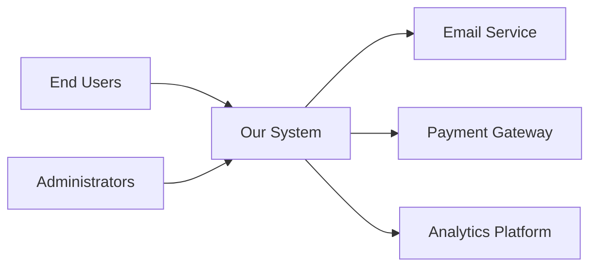

### External Entities

| Entity | Relationship | Interface |
|--------|--------------|-----------|
| End Users | Use system via web browser | HTTPS/REST API |
| Administrators | Manage system | Admin UI, API |
| Email Service | Sends notifications | SMTP/API |
| Payment Gateway | Processes payments | REST API |
| Analytics Platform | Receives usage data | REST API/Events |

## Technical Context

[Diagram showing technical interfaces]

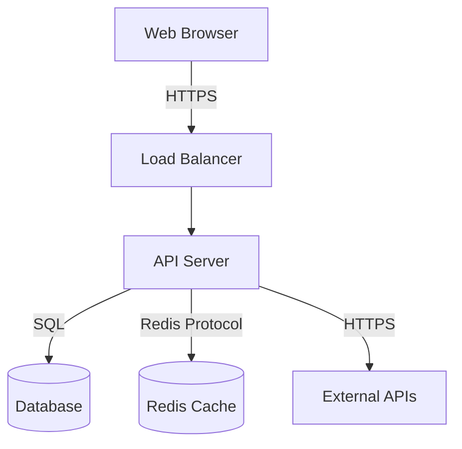

### Technical Interfaces

| Interface | Technology | Purpose |
|-----------|-----------|---------|
| Web UI | HTTPS, JSON | User interaction |
| REST API | HTTPS, JSON | Programmatic access |
| Database | PostgreSQL protocol | Data persistence |
| Cache | Redis protocol | Performance optimization |
| External APIs | HTTPS, various | Third-party integrations |

## System Boundary

**Inside the System**:
- Web application
- API server
- Background workers
- Database
- Cache

**Outside the System**:
- User browsers
- External services (email, payment, etc.)
- Monitoring systems
- Identity providers

## Related Documentation

- [[05-building-blocks|Building Block View]]
- [[07-deployment|Deployment View]]
- [[../architecture/README|Architecture]]

#arc42 #context
```

### Section 4: Solution Strategy

Create `vault/arc42/04-solution.md`:

```markdown
# 4. Solution Strategy

**Last Updated**: YYYY-MM-DD

## Overview

[Summary of the fundamental decisions and solution approaches]

## Technology Decisions

| Aspect | Choice | Rationale | ADR |
|--------|--------|-----------|-----|
| Backend | Clojure/JVM | Functional programming, Java ecosystem | [[../decisions/0001-clojure]] |
| Frontend | [Framework] | [Rationale] | [[../decisions/0002-frontend]] |
| Database | PostgreSQL | ACID, relational data | [[../decisions/0003-database]] |
| Cache | Redis | Performance, session storage | [[../decisions/0004-cache]] |
| Deployment | Docker/K8s | Containerization, orchestration | [[../decisions/0005-deployment]] |

## Architectural Approach

### Architecture Style

**Chosen**: Layered Architecture with Hexagonal Architecture principles

**Rationale**:
- Clear separation of concerns
- Business logic independent of frameworks
- Testability
- Flexibility to change infrastructure

**Alternatives Considered**:
- Microservices: Too complex for current team size
- Monolith: Chosen initially, can evolve later

### Key Patterns

1. **Repository Pattern**: Abstract data access
2. **Dependency Injection**: Decouple components
3. **Railway-Oriented Programming**: Error handling
4. **Event-Driven**: For async operations

## Quality Goal Achievement

### Goal 1: Performance

**Target**: p95 response time < 200ms

**Approach**:
- Multi-level caching (Redis)
- Database query optimization
- Async operations for I/O
- CDN for static assets

### Goal 2: Security

**Target**: Pass security audit, no critical vulnerabilities

**Approach**:
- JWT authentication
- Role-based authorization
- Input validation at all layers
- Encryption at rest and in transit
- Regular security scanning

### Goal 3: Maintainability

**Target**: Onboard new developer in 1 week

**Approach**:
- Comprehensive documentation
- Consistent code style
- High test coverage (>80%)
- Clear component boundaries

## High-Level Decomposition

```
┌─────────────────────────────────────┐
│         Presentation Layer          │
│  (API Handlers, Request/Response)   │
└──────────────┬──────────────────────┘
               │
┌──────────────▼──────────────────────┐
│       Application Layer             │
│    (Use Cases, Orchestration)       │
└──────────────┬──────────────────────┘
               │
┌──────────────▼──────────────────────┐
│          Domain Layer               │
│  (Business Logic, Domain Model)     │
└──────────────┬──────────────────────┘
               │
┌──────────────▼──────────────────────┐
│      Infrastructure Layer           │
│  (Database, Cache, External APIs)   │
└─────────────────────────────────────┘
```

## Related Documentation

- [[01-introduction|Introduction and Goals]]
- [[02-constraints|Constraints]]
- [[05-building-blocks|Building Block View]]
- [[../decisions/index|All ADRs]]

#arc42 #solution-strategy
```

### Section 5: Building Block View

Create `vault/arc42/05-building-blocks.md`:

```markdown
# 5. Building Block View

**Last Updated**: YYYY-MM-DD

## Level 1: System Overview

[High-level component diagram]

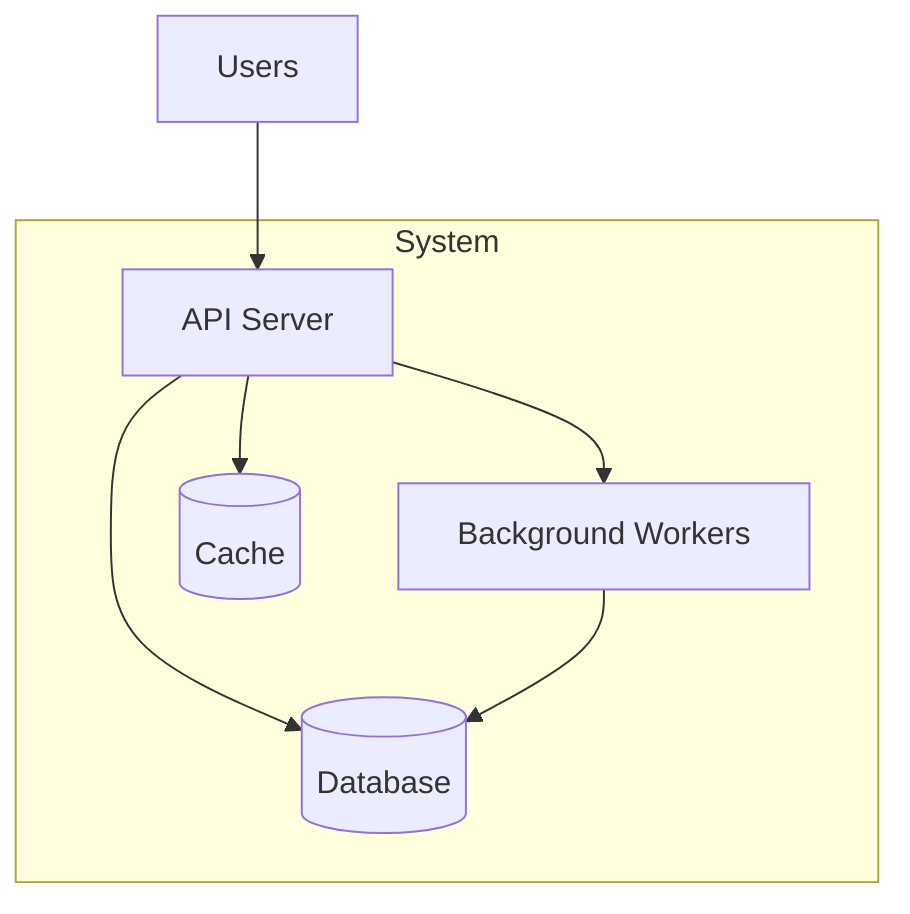

### Components

| Component | Responsibility | Technology |
|-----------|---------------|------------|
| API Server | Handle HTTP requests, business logic | Clojure, Ring, Reitit |
| Background Workers | Async tasks, scheduled jobs | Clojure |
| Database | Data persistence | PostgreSQL |
| Cache | Performance optimization | Redis |

## Level 2: API Server Decomposition

```
api-server/
├── handlers/        # HTTP request handlers
├── services/        # Business logic / use cases
├── repositories/    # Data access
├── middleware/      # Cross-cutting concerns
└── routes/          # URL routing
```

### Handler Layer

**Responsibility**: Handle HTTP requests and responses

**Components**:
- `user-handler` - User registration, login, profile
- `resource-handler` - Resource CRUD operations
- `admin-handler` - Administrative functions

**Example**:
```clojure
(defn register-handler [user-service]
  (fn [request]
    (let [data (-> request :body)
          result (user-service/register data)]
      (if (:error result)
        {:status 400 :body (:error result)}
        {:status 201 :body (:user result)}))))
```

### Service Layer

**Responsibility**: Implement business logic and use cases

**Components**:
- `user-service` - User management logic
- `resource-service` - Resource management logic
- `auth-service` - Authentication and authorization

**Example**:
```clojure
(defn register [repo validator data]
  (-> data
      (validator/validate)
      (and-then #(check-unique-email repo %))
      (and-then create-user-entity)
      (and-then hash-password)
      (and-then #(repo/save repo %))
      (on-error handle-error)))
```

### Repository Layer

**Responsibility**: Abstract data access

**Components**:
- `user-repository` - User data access
- `resource-repository` - Resource data access
- `audit-repository` - Audit log storage

**Example**:
```clojure
(defprotocol UserRepository
  (find-by-id [this id])
  (find-by-email [this email])
  (save [this user])
  (delete [this id]))
```

## Level 3: Detailed Component View

### User Service

**Responsibilities**:
- User registration
- User authentication
- Password management
- Profile updates

**Dependencies**:
- `user-repository` - Data access
- `email-service` - Send verification emails
- `password-hasher` - Hash passwords

**Interfaces**:
```clojure
(defprotocol UserService
  (register [this data])
  (authenticate [this email password])
  (reset-password [this email])
  (update-profile [this user-id data]))
```

### Resource Service

**Responsibilities**:
- Create resources
- Update resources
- Delete resources (soft delete)
- Query resources

**Dependencies**:
- `resource-repository` - Data access
- `auth-service` - Authorization checks
- `event-bus` - Publish resource events

**Interfaces**:
```clojure
(defprotocol ResourceService
  (create [this user-id data])
  (update [this user-id resource-id data])
  (delete [this user-id resource-id])
  (find-by-id [this resource-id])
  (list-for-user [this user-id opts]))
```

## Component Interactions

### User Registration Flow

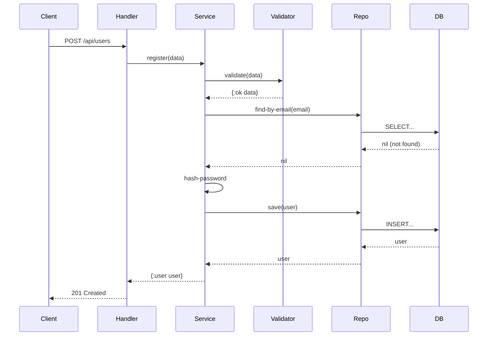

## Design Principles

1. **Dependency Inversion**: High-level modules don't depend on low-level modules
2. **Single Responsibility**: Each component has one reason to change
3. **Open/Closed**: Open for extension, closed for modification
4. **Interface Segregation**: Clients don't depend on unused interfaces
5. **Dependency Injection**: Components receive dependencies externally

## Related Documentation

- [[04-solution|Solution Strategy]]
- [[06-runtime|Runtime View]]
- [[08-crosscutting|Cross-cutting Concepts]]

#arc42 #building-blocks
```

### Section 6: Runtime View

Create `vault/arc42/06-runtime.md`:

```markdown
# 6. Runtime View

**Last Updated**: YYYY-MM-DD

## Overview

[Dynamic behavior of the system through key scenarios]

## Scenario 1: User Registration

**Goal**: New user creates an account

**Actors**: Unregistered user

**Preconditions**: None

**Flow**:

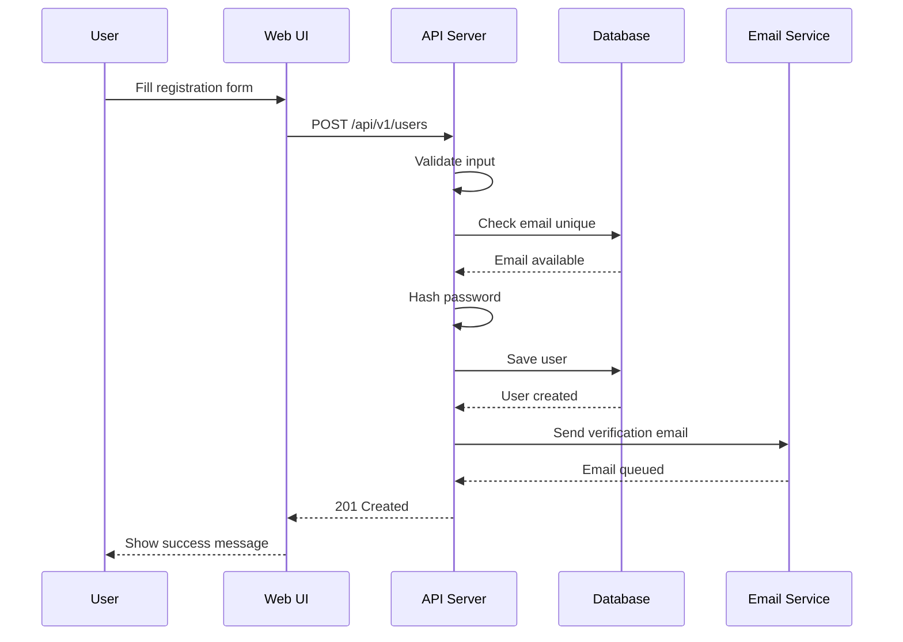

**Postconditions**:
- User account created in database
- Verification email sent
- User redirected to email verification page

**Error Scenarios**:
- Email already exists → 409 Conflict
- Invalid email format → 400 Bad Request
- Weak password → 400 Bad Request

## Scenario 2: User Authentication

**Goal**: User logs into the system

**Actors**: Registered user

**Preconditions**: User has registered account

**Flow**:

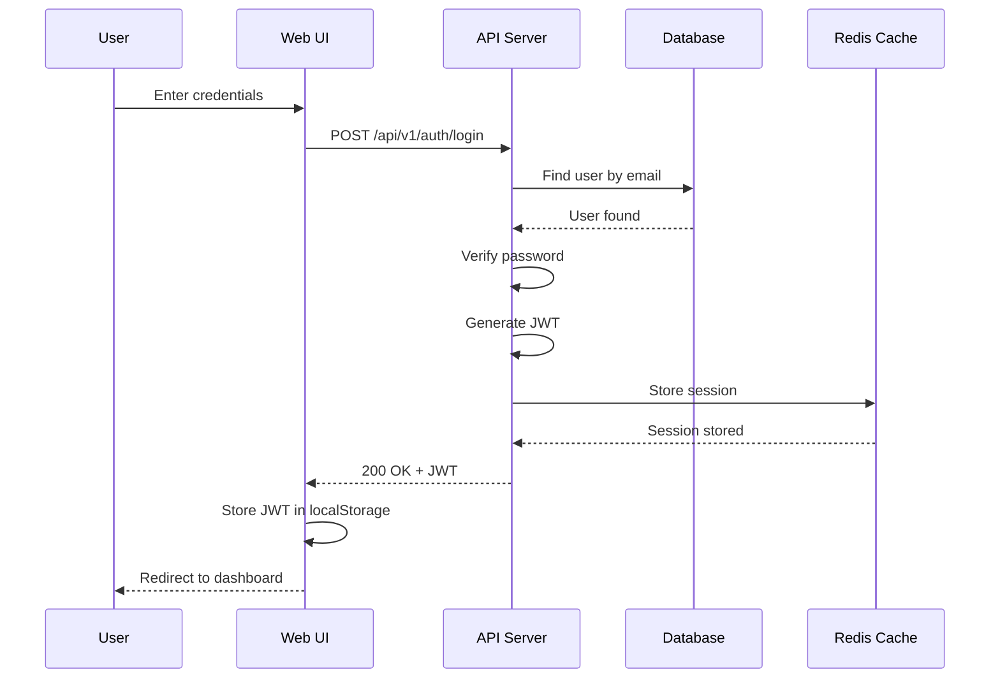

**Postconditions**:
- JWT token generated and returned
- Session stored in cache
- User authenticated

**Error Scenarios**:
- Invalid credentials → 401 Unauthorized
- Account locked → 403 Forbidden
- Account not verified → 403 Forbidden

## Scenario 3: Create Resource

**Goal**: Authenticated user creates a new resource

**Actors**: Authenticated user

**Preconditions**: User is logged in

**Flow**:

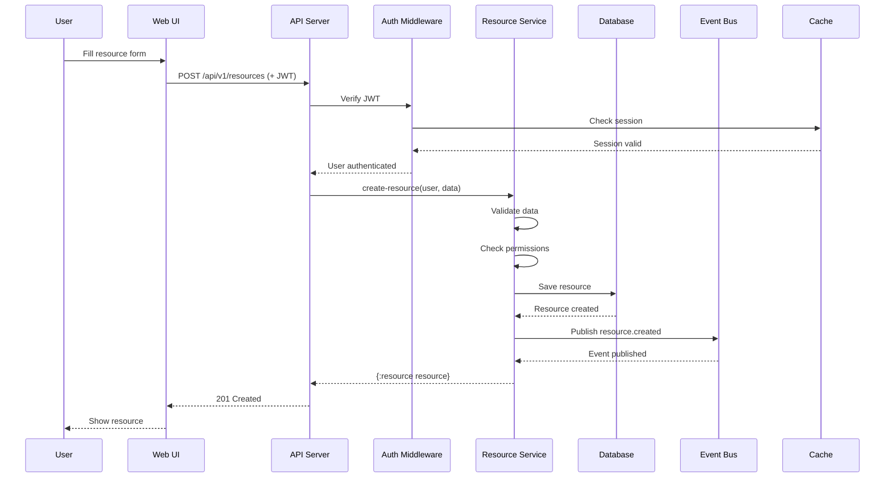

**Postconditions**:
- Resource created in database
- Event published for async processing
- User sees created resource

**Error Scenarios**:
- Invalid JWT → 401 Unauthorized
- Invalid data → 400 Bad Request
- Quota exceeded → 403 Forbidden

## Scenario 4: Background Job Processing

**Goal**: Process async tasks without blocking API

**Actors**: Background worker

**Trigger**: Event published or scheduled

**Flow**:

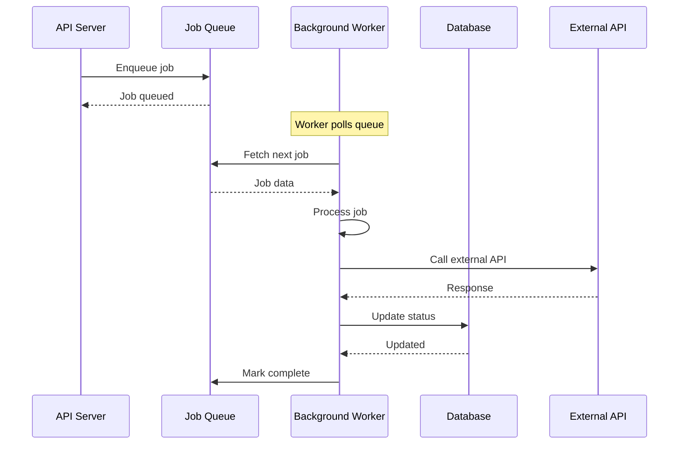

**Examples**:
- Send notification emails
- Generate reports
- Process uploaded files
- Sync with external systems
- Cleanup expired data

## Scenario 5: Database Transaction

**Goal**: Ensure data consistency with transactions

**Example**: Transfer resource ownership

**Flow**:

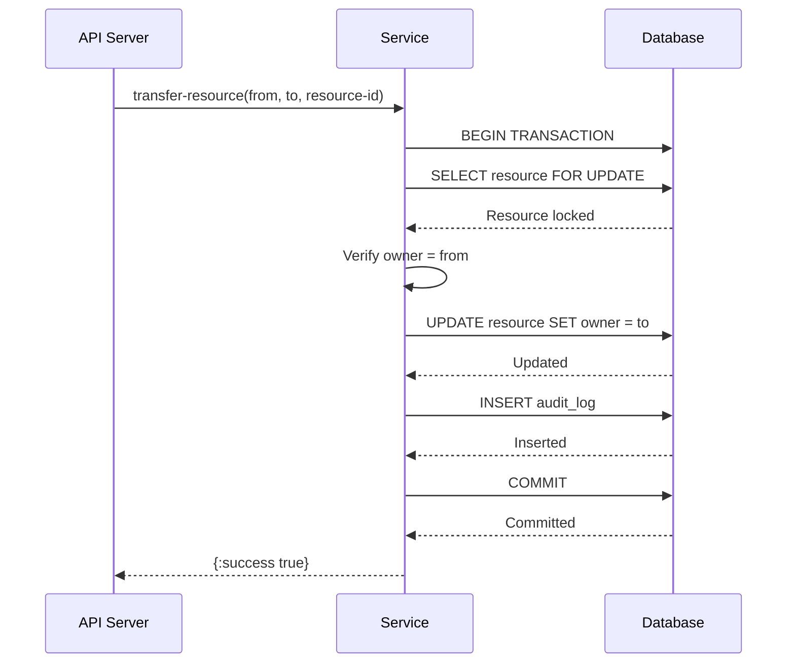

**Ensures**:
- Atomicity: All or nothing
- Consistency: Valid state transitions
- Isolation: Concurrent safety
- Durability: Changes persisted

## Scenario 6: Caching Strategy

**Goal**: Optimize performance with caching

**Flow**:

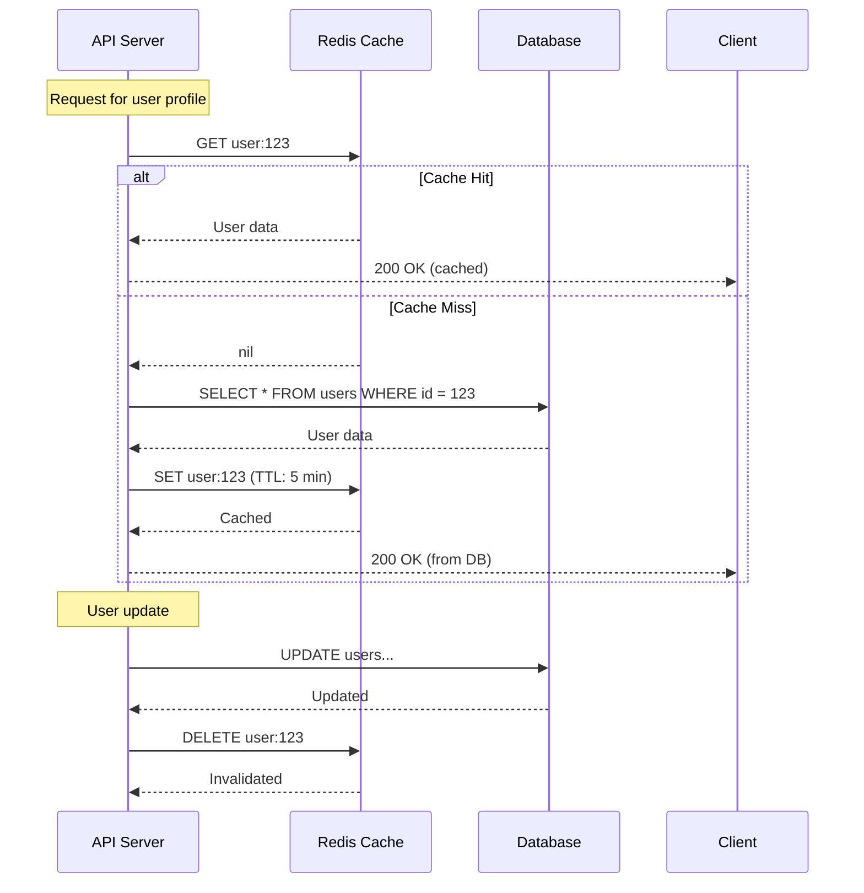

## Related Documentation

- [[05-building-blocks|Building Block View]]
- [[07-deployment|Deployment View]]
- [[../specifications/README|Specifications]]

#arc42 #runtime #scenarios
```

### Section 9: Architecture Decisions

Create `vault/arc42/09-decisions.md`:

```markdown
# 9. Architecture Decisions

**Last Updated**: YYYY-MM-DD

## Overview

This section summarizes important architectural decisions. Full details are in individual ADRs in [[../decisions/index|the decisions folder]].

## Decision Categories

### Technology Stack

| Decision | Status | Summary | ADR |
|----------|--------|---------|-----|
| Use Clojure for backend | Accepted | Functional programming, JVM ecosystem | [[../decisions/0001-clojure]] |
| Use PostgreSQL | Accepted | Relational data, ACID compliance | [[../decisions/0003-postgres]] |
| Use Redis for caching | Accepted | Performance optimization | [[../decisions/0004-redis]] |

### Architecture Patterns

| Decision | Status | Summary | ADR |
|----------|--------|---------|-----|
| Layered architecture | Accepted | Separation of concerns, testability | [[../decisions/0010-layers]] |
| Repository pattern | Accepted | Abstract data access | [[../decisions/0011-repository]] |
| Event-driven async | Accepted | Decouple async operations | [[../decisions/0012-events]] |

### Deployment

| Decision | Status | Summary | ADR |
|----------|--------|---------|-----|
| Docker containers | Accepted | Consistent environments | [[../decisions/0020-docker]] |
| Blue-green deployment | Accepted | Zero-downtime updates | [[../decisions/0021-blue-green]] |
| AWS cloud platform | Accepted | Managed services, scalability | [[../decisions/0022-aws]] |

### Security

| Decision | Status | Summary | ADR |
|----------|--------|---------|-----|
| JWT authentication | Accepted | Stateless, scalable auth | [[../decisions/0030-jwt]] |
| RBAC authorization | Accepted | Flexible permissions | [[../decisions/0031-rbac]] |
| Bcrypt password hash | Accepted | Secure password storage | [[../decisions/0032-bcrypt]] |

## Decision Timeline

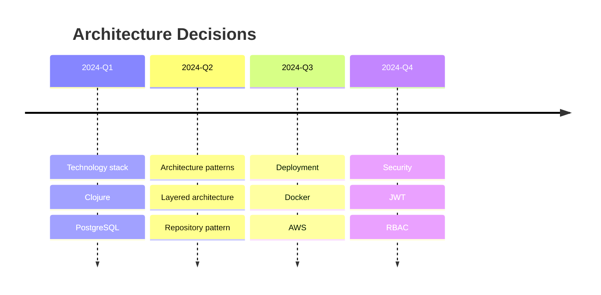

## Key Decisions Explained

### Why Clojure?

**Context**: Choosing backend language

**Decision**: Use Clojure on JVM

**Rationale**:
- Team expertise in functional programming
- Rich ecosystem (Java interop)
- REPL-driven development
- Immutable data structures (easier concurrency)
- Strong support for data transformation

**Consequences**:
- ✅ Productive development
- ✅ Easy testing
- ✅ Good performance
- ❌ Smaller talent pool
- ❌ Longer onboarding for OOP developers

**See**: [[../decisions/0001-clojure]]

### Why Layered Architecture?

**Context**: Choosing overall architecture style

**Decision**: Layered architecture with hexagonal principles

**Rationale**:
- Clear separation of concerns
- Business logic independent of frameworks
- Testability without external dependencies
- Flexibility to change infrastructure
- Team size appropriate for monolith

**Alternatives Considered**:
- Microservices: Too complex for current team
- Pure monolith: Harder to test and evolve
- Event-driven: Unnecessary complexity initially

**Consequences**:
- ✅ Easy to understand and navigate
- ✅ High testability
- ✅ Framework independence
- ✅ Can evolve to microservices later
- ❌ Requires discipline to maintain boundaries

**See**: [[../decisions/0010-layered-architecture]]

### Why PostgreSQL?

**Context**: Choosing primary database

**Decision**: Use PostgreSQL for data persistence

**Rationale**:
- Strong ACID guarantees needed
- Relational data model fits domain
- Rich feature set (JSON, full-text search, etc.)
- Excellent tooling and ecosystem
- Team experience

**Alternatives Considered**:
- MongoDB: Less suited for relational data
- MySQL: Less feature-rich
- Datomic: Interesting but less mature tooling

**Consequences**:
- ✅ Data integrity
- ✅ Flexible querying
- ✅ Good performance
- ✅ Well-known technology
- ❌ Vertical scaling limits

**See**: [[../decisions/0003-postgres]]

## Superseded Decisions

| Decision | Superseded By | Reason |
|----------|---------------|--------|
| [Example: Use REST] | [[../decisions/0040-graphql]] | Better fit for mobile clients |

## Decision Principles

When making architectural decisions, we follow these principles:

1. **Reversibility**: Prefer decisions that are easier to reverse
2. **Simplicity**: Choose simpler solutions when possible
3. **Standards**: Use industry standards and best practices
4. **Team Knowledge**: Consider team expertise and learning curve
5. **Future-Ready**: Allow for future growth and changes

## Decision Process

1. **Identify** need for decision
2. **Research** options and alternatives
3. **Discuss** with team
4. **Document** in ADR
5. **Decide** and communicate
6. **Review** periodically

## Related Documentation

- [[../decisions/index|Complete ADR Index]]
- [[01-introduction|Introduction and Goals]]
- [[02-constraints|Constraints]]
- [[04-solution|Solution Strategy]]

#arc42 #decisions
```

### Section 10: Quality Requirements

Create `vault/arc42/10-quality.md`:

```markdown
# 10. Quality Requirements

**Last Updated**: YYYY-MM-DD

## Quality Tree

Based on ISO/IEC 25010 quality model.

```
System Quality
├── Performance Efficiency
│   ├── Response Time (HIGH)
│   ├── Throughput (MEDIUM)
│   └── Resource Utilization (MEDIUM)
├── Security (HIGH)
│   ├── Authentication
│   ├── Authorization
│   ├── Data Protection
│   └── Audit Logging
├── Reliability (HIGH)
│   ├── Availability
│   ├── Fault Tolerance
│   └── Recoverability
├── Maintainability (MEDIUM)
│   ├── Testability
│   ├── Modularity
│   └── Analyzability
└── Usability (MEDIUM)
    ├── Learnability
    └── Operability
```

## Quality Scenarios

### Performance Scenarios

#### Scenario 1: API Response Time

**Stimulus**: User requests resource list

**Environment**: Normal operation, 100 concurrent users

**Response**: System returns results

**Measure**:
- p50 < 100ms
- p95 < 200ms
- p99 < 500ms

**Priority**: HIGH

**Related**:
- [[../specifications/features#performance-tests]]
- [[08-crosscutting#caching]]

#### Scenario 2: Database Query Performance

**Stimulus**: Complex query with joins

**Environment**: Database with 1M records

**Response**: Query executes and returns results

**Measure**:
- p95 < 50ms
- No full table scans
- Proper index usage

**Priority**: MEDIUM

### Security Scenarios

#### Scenario 3: Authentication

**Stimulus**: User attempts to access protected resource

**Environment**: Production system

**Response**: System validates JWT and permissions

**Measure**:
- Invalid JWT → 401 response
- Expired JWT → 401 response
- Missing permissions → 403 response
- Validation < 10ms

**Priority**: HIGH

**Related**:
- [[../security/README]]
- [[../decisions/0030-jwt-auth]]

#### Scenario 4: Data Protection

**Stimulus**: Unauthorized access attempt

**Environment**: Production system

**Response**: System denies access and logs attempt

**Measure**:
- All sensitive data encrypted at rest
- All connections use TLS 1.3
- Failed access attempts logged
- Passwords never logged

**Priority**: HIGH

### Reliability Scenarios

#### Scenario 5: Service Availability

**Stimulus**: Server instance fails

**Environment**: Production with multiple instances

**Response**: System continues operating

**Measure**:
- Uptime > 99.9% (< 43 minutes downtime/month)
- Auto-recovery < 2 minutes
- No data loss

**Priority**: HIGH

**Related**: [[07-deployment#disaster-recovery]]

#### Scenario 6: Database Failure

**Stimulus**: Primary database crashes

**Environment**: Production with replication

**Response**: System fails over to replica

**Measure**:
- Failover < 2 minutes
- Data loss < 5 minutes (RPO)
- Service restored < 1 hour (RTO)

**Priority**: HIGH

### Maintainability Scenarios

#### Scenario 7: Adding New Feature

**Stimulus**: Developer adds new API endpoint

**Environment**: Development environment

**Response**: Feature implemented and tested

**Measure**:
- Implementation time < 1 day for simple feature
- Tests written (TDD)
- Documentation updated
- Code review completed

**Priority**: MEDIUM

#### Scenario 8: Debugging Production Issue

**Stimulus**: Error occurs in production

**Environment**: Production logs and monitoring

**Response**: Developer identifies root cause

**Measure**:
- Structured logs enable tracing
- Request ID traces full flow
- Root cause identified < 1 hour
- Metrics show impact

**Priority**: MEDIUM

**Related**: [[08-crosscutting#logging]]

### Usability Scenarios

#### Scenario 9: API Usability

**Stimulus**: Developer integrates with API

**Environment**: API documentation available

**Response**: Developer successfully integrates

**Measure**:
- API documentation complete
- Examples provided
- Error messages clear
- Integration time < 4 hours

**Priority**: MEDIUM

## Quality Metrics

### Performance Metrics

| Metric | Target | Monitoring |
|--------|--------|------------|
| API Response Time (p95) | < 200ms | CloudWatch |
| API Response Time (p99) | < 500ms | CloudWatch |
| Database Query Time (p95) | < 50ms | Application logs |
| Cache Hit Rate | > 80% | Redis metrics |
| Error Rate | < 0.1% | Application logs |

### Reliability Metrics

| Metric | Target | Monitoring |
|--------|--------|------------|
| Uptime | > 99.9% | Health checks |
| Mean Time To Recovery | < 1 hour | Incident logs |
| Mean Time Between Failures | > 720 hours | Incident logs |
| Data Backup Success Rate | 100% | Backup logs |

### Security Metrics

| Metric | Target | Monitoring |
|--------|--------|------------|
| Failed Auth Attempts | < 1% of total | Auth logs |
| Security Vulnerabilities | 0 critical | Security scans |
| SSL/TLS Coverage | 100% | Configuration |
| Password Strength | All meet policy | Validation |

### Maintainability Metrics

| Metric | Target | Monitoring |
|--------|--------|------------|
| Test Coverage | > 80% | CI/CD |
| Build Success Rate | > 95% | CI/CD |
| Code Review Time | < 1 day | GitHub |
| Documentation Coverage | All public APIs | Manual review |

## Quality Requirements by Priority

### Critical (Must Have)

1. **Security**: Authentication, authorization, encryption
2. **Reliability**: 99.9% uptime, data durability
3. **Performance**: p95 response time < 200ms

### High (Should Have)

4. **Maintainability**: Test coverage > 80%, clear code
5. **Operability**: Monitoring, logging, alerting

### Medium (Nice to Have)

6. **Usability**: Clear API, good documentation
7. **Scalability**: Handle 10x traffic growth

## Testing Quality Requirements

### Performance Testing

```bash
# Load testing with k6
k6 run --vus 100 --duration 5m load-test.js

# Expected results:
# - p95 < 200ms
# - p99 < 500ms
# - Error rate < 0.1%
```

### Security Testing

```bash
# Dependency scanning
clj -M:outdated

# OWASP dependency check
dependency-check --scan target/

# Static security analysis
clj-kondo --lint src/
```

### Reliability Testing

```bash
# Chaos engineering
# Randomly kill instances, verify recovery

# Backup testing
# Restore from backup, verify data integrity
```

## Related Documentation

- [[01-introduction|Introduction and Goals]]
- [[08-crosscutting|Cross-cutting Concepts]]
- [[../requirements/quality-attributes|Quality Attributes Detail]]
- [[../specifications/features|Behavioral Specifications]]

#arc42 #quality #requirements
```

### Section 11: Risks and Technical Debt

Create `vault/arc42/11-risks.md`:

```markdown
# 11. Risks and Technical Debt

**Last Updated**: YYYY-MM-DD

## Technical Risks

### Risk 1: Database Scalability

**Description**: PostgreSQL vertical scaling limits

**Probability**: Medium

**Impact**: High

**Indicators**:
- Database CPU > 80% sustained
- Query performance degrading
- Connection pool exhausted

**Mitigation**:
- Read replicas for read-heavy workloads
- Connection pooling optimization
- Query optimization and indexing
- Prepare for sharding if needed

**Monitoring**:
- Database CPU metrics
- Query execution times
- Connection pool usage

**Status**: Monitored

**Related**: [[07-deployment#database]]

### Risk 2: External API Dependency

**Description**: System depends on external APIs

**Probability**: Low

**Impact**: Medium

**Affected APIs**:
- Email service (SendGrid)
- Payment gateway (Stripe)
- Analytics (Mixpanel)

**Mitigation**:
- Implement circuit breakers
- Graceful degradation
- Retry with exponential backoff
- Queue for async operations
- Have alternative providers

**Monitoring**:
- External API response times
- Error rates for external calls
- Circuit breaker states

**Status**: Mitigated

**Related**: [[08-crosscutting#error-handling]]

### Risk 3: Security Vulnerabilities

**Description**: Security vulnerabilities in dependencies or code

**Probability**: Medium

**Impact**: Critical

**Threat Vectors**:
- Dependency vulnerabilities
- SQL injection
- XSS attacks
- Authentication bypass
- Data breaches

**Mitigation**:
- Regular dependency updates
- Automated security scanning
- Input validation at all layers
- Security code reviews
- Penetration testing
- Security training for team

**Monitoring**:
- Dependency vulnerability scans
- Security audit logs
- Failed authentication attempts
- OWASP Top 10 checks

**Status**: Actively managed

**Related**:
- [[../security/README]]
- [[08-crosscutting#security]]

### Risk 4: Data Loss

**Description**: Potential for data loss due to failures

**Probability**: Low

**Impact**: Critical

**Scenarios**:
- Database corruption
- Accidental deletion
- Ransomware attack
- Infrastructure failure

**Mitigation**:
- Daily automated backups
- Point-in-time recovery
- Multi-region replication
- Soft deletes for user data
- Test recovery procedures monthly
- Immutable backups

**Monitoring**:
- Backup success rate
- Backup integrity checks
- Replication lag

**Status**: Mitigated

**Related**: [[07-deployment#disaster-recovery]]

### Risk 5: Performance Degradation

**Description**: System performance degrades as load increases

**Probability**: Medium

**Impact**: Medium

**Indicators**:
- Response times increasing
- Database slow queries
- Memory pressure
- High CPU utilization

**Mitigation**:
- Auto-scaling for compute
- Database optimization
- Caching strategy
- Performance testing in CI
- Capacity planning

**Monitoring**:
- Application metrics (response time, error rate)
- Infrastructure metrics (CPU, memory, disk)
- Database metrics (query time, connections)

**Status**: Monitored

## Technical Debt

### Debt 1: Missing Integration Tests

**Description**: Limited integration test coverage for API endpoints

**Impact**: Medium - harder to catch regressions

**Effort to Fix**: 2-3 weeks

**Why It Exists**: Focus on shipping MVP quickly

**Plan**:
- Add integration tests to CI/CD
- Target 80% coverage of critical paths
- Use Gherkin scenarios
- Scheduled for Q2 2025

**Status**: Acknowledged, planned

**Related**: [[08-crosscutting#testing-strategy]]

### Debt 2: Monolithic Deployment

**Description**: All services deployed as single unit

**Impact**: Low currently, Medium if team grows

**Effort to Fix**: 4-6 weeks

**Why It Exists**: Simpler for small team

**Plan**:
- Extract background workers first
- Evaluate microservices if team > 10
- Not urgent for current scale

**Status**: Accepted (not a problem yet)

**Related**: [[04-solution#architectural-approach]]

### Debt 3: Manual Database Migrations

**Description**: No automated migration tool

**Impact**: Medium - risk of human error

**Effort to Fix**: 1 week

**Why It Exists**: Small number of migrations so far

**Plan**:
- Adopt Flyway or Liquibase
- Automate in CI/CD
- Scheduled for Q1 2025

**Status**: Planned

### Debt 4: Inconsistent Error Handling

**Description**: Error handling patterns vary across codebase

**Impact**: Low - harder to debug issues

**Effort to Fix**: 2 weeks

**Why It Exists**: Evolved organically

**Plan**:
- Standardize on Railway-Oriented Programming
- Refactor gradually
- Document pattern

**Status**: In progress

**Related**: [[08-crosscutting#error-handling]]

### Debt 5: Limited Observability

**Description**: Basic logging but limited tracing and metrics

**Impact**: Medium - harder to debug production issues

**Effort to Fix**: 3 weeks

**Why It Exists**: Not critical for MVP

**Plan**:
- Add distributed tracing (Jaeger/X-Ray)
- Enhance metrics (Prometheus/CloudWatch)
- Improve log structure
- Scheduled for Q2 2025

**Status**: Planned

**Related**: [[08-crosscutting#monitoring]]

## Threat Model Summary

[If Threagile threat model exists, link it here]

**Tool**: Threagile

**Last Updated**: YYYY-MM-DD

**Critical Threats**:
1. [Threat 1] - Mitigated by [control]
2. [Threat 2] - Mitigated by [control]
3. [Threat 3] - Risk accepted

**Medium Threats**:
1. [Threat 4] - Planned mitigation
2. [Threat 5] - Under review

**Full Model**: [[../security/threat-model]]

## Risk Management Process

### Risk Assessment

Risks are assessed quarterly or when significant changes occur.

**Probability Scale**:
- Low: < 10% chance
- Medium: 10-50% chance
- High: > 50% chance

**Impact Scale**:
- Low: Minimal impact on system/business
- Medium: Significant but manageable impact
- High: Major impact
- Critical: Catastrophic impact

### Risk Priority Matrix

| Impact / Probability | Low | Medium | High |
|---------------------|-----|--------|------|
| Critical | Monitor | Mitigate | Immediate |
| High | Monitor | Mitigate | Urgent |
| Medium | Accept | Monitor | Mitigate |
| Low | Accept | Accept | Monitor |

### Technical Debt Management

**Principles**:
1. **Track All Debt**: Document when taking on debt
2. **Understand Cost**: Estimate effort to fix
3. **Plan Payback**: Schedule debt reduction
4. **Limit Growth**: Don't let debt accumulate unchecked

**Quarterly Review**:
- Assess current debt
- Prioritize payback
- Allocate 20% of sprint capacity to debt reduction

## Related Documentation

- [[10-quality|Quality Requirements]]
- [[../security/README|Security Documentation]]
- [[../decisions/index|ADRs]] - Decisions accepting technical debt

#arc42 #risks #technical-debt
```

### Section 12: Glossary

Create `vault/arc42/12-glossary.md`:

```markdown
# 12. Glossary

**Last Updated**: YYYY-MM-DD

## Domain Terms

### A

**ADR (Architectural Decision Record)**
A document that captures an important architectural decision made along with its context and consequences.

### B

**Background Worker**
A service that processes async tasks without blocking API requests. Handles jobs like email sending, report generation, and data processing.

### C

**Cache**
In-memory data store (Redis) used to speed up data access and reduce database load.

### D

**Domain Model**
The core business concepts and their relationships, independent of technical implementation.

### E

**Entity**
A domain object with a unique identity that persists over time (e.g., User, Resource).

### H

**Hexagonal Architecture**
An architectural pattern that isolates core business logic from external concerns, making the system more testable and flexible. Also known as Ports and Adapters.

### I

**Idempotent**
An operation that produces the same result whether executed once or multiple times.

### J

**JWT (JSON Web Token)**
A compact, URL-safe token format used for authentication and information exchange.

### L

**Layered Architecture**
An architectural pattern organizing code into layers (presentation, application, domain, infrastructure) with dependencies flowing in one direction.

### M

**Middleware**
Functions that process requests and responses in the HTTP pipeline (e.g., authentication, logging).

### P

**Point-in-Time Recovery (PITR)**
The ability to restore a database to any moment in time within the backup retention period.

### R

**Repository**
A pattern that abstracts data access, providing a collection-like interface to domain objects.

**Railway-Oriented Programming**
A functional programming pattern for error handling where operations are chained and errors short-circuit the pipeline.

**RBAC (Role-Based Access Control)**
An authorization approach where permissions are assigned to roles, and users are assigned roles.

**RTO (Recovery Time Objective)**
The target time within which a system must be restored after a disaster.

**RPO (Recovery Point Objective)**
The maximum acceptable amount of data loss measured in time.

### S

**Scenario**
A description of a system's behavior in response to a stimulus, used to specify quality requirements.

**Soft Delete**
Marking records as deleted rather than removing them from the database, preserving audit history.

### T

**Transaction**
A sequence of database operations that execute as a single unit (all succeed or all fail).

### U

**Use Case**
A specific way a user interacts with the system to achieve a goal.

### V

**Value Object**
A domain object defined by its attributes rather than identity (e.g., Address, Money).

## Technical Abbreviations

### A

**API**
Application Programming Interface

**AWS**
Amazon Web Services

### C

**CDN**
Content Delivery Network

**CI/CD**
Continuous Integration / Continuous Deployment

**CORS**
Cross-Origin Resource Sharing

**CPU**
Central Processing Unit

**CRUD**
Create, Read, Update, Delete

### D

**DB**
Database

**DI**
Dependency Injection

### E

**ECS**
Elastic Container Service (AWS)

### G

**GDPR**
General Data Protection Regulation

### H

**HIPAA**
Health Insurance Portability and Accountability Act

**HTTP**
Hypertext Transfer Protocol

**HTTPS**
HTTP Secure

### I

**I/O**
Input/Output

**IAM**
Identity and Access Management

### J

**JSON**
JavaScript Object Notation

**JVM**
Java Virtual Machine

### K

**K8s**
Kubernetes

### M

**MFA**
Multi-Factor Authentication

**MVP**
Minimum Viable Product

### P

**PG**
PostgreSQL

### R

**RAM**
Random Access Memory

**RDS**
Relational Database Service (AWS)

**REST**
Representational State Transfer

### S

**S3**
Simple Storage Service (AWS)

**SDK**
Software Development Kit

**SLA**
Service Level Agreement

**SMTP**
Simple Mail Transfer Protocol

**SQL**
Structured Query Language

**SSL/TLS**
Secure Sockets Layer / Transport Layer Security

### T

**TDD**
Test-Driven Development

**TTL**
Time To Live

### U

**UI**
User Interface

**URL**
Uniform Resource Locator

**UUID**
Universally Unique Identifier

### V

**VPC**
Virtual Private Cloud

### X

**XSS**
Cross-Site Scripting

## Project-Specific Terms

[Add project-specific terms here]

### [Term]

[Definition]

## Related Documentation

- [[01-introduction|Introduction and Goals]]
- [[05-building-blocks|Building Block View]]
- [[../architecture/README|Architecture Documentation]]

#arc42 #glossary
```

## Best Practices

1. **Start Simple**: Don't try to complete all sections perfectly initially
2. **Iterate**: Update documentation as architecture evolves
3. **Link Everything**: Use wikilinks to connect related concepts
4. **Visual Aids**: Include diagrams (Mermaid, PlantUML, or Overarch)
5. **Keep Current**: Review and update quarterly
6. **Team Effort**: Architecture docs are a team responsibility
7. **Living Document**: Treat as living documentation, not static artifact

## Integration with Other Tools

### Overarch

If using Overarch for architecture modeling:

```bash
# Generate diagrams from models
overarch -m models/ -r vault/arc42/diagrams/ -f png

# Reference in arc42 sections

```

### Threagile

If using Threagile for threat modeling:

```bash
# Generate threat model
threagile -model threagile.yaml -output vault/security/

# Reference in Section 11
See [[../security/threat-model]] for complete analysis
```

### ADRs

Link to ADRs throughout arc42 sections:

```markdown
Decision to use JWT: [[../decisions/0030-jwt-auth]]
```

## Related Skills

- **init-obsidian-vault**: Must run first to create vault structure
- **adr-management**: Use to create and manage ADRs
- **iso25010-quality**: Use to define quality requirements for Section 10
- **scenari-specs**: Use to create behavioral specs referenced in Section 6

#arc42 #architecture #documentation
