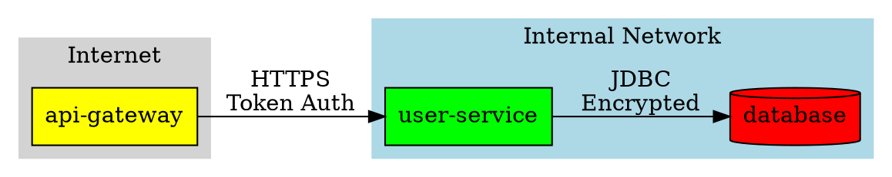

# Threagile Output Formats Reference

This document describes all output formats generated by Threagile analysis, including reports, diagrams, and data files.

## Overview

When running `threagile analyze-model`, multiple output files are generated in the specified output directory. These files provide different views of the threat analysis results for various audiences and use cases.

## Output Files Summary

| File | Format | Purpose | Audience |
|------|--------|---------|----------|
| `report.pdf` | PDF | Comprehensive threat report | Managers, stakeholders |
| `risks.json` | JSON | Machine-readable risk data | Tools, automation |
| `risks.xlsx` | Excel | Editable risk spreadsheet | Security teams |
| `tags.xlsx` | Excel | Tag-based risk grouping | Teams, projects |
| `technical-assets.json` | JSON | Asset inventory | Tools, CMDB |
| `stats.json` | JSON | Analysis statistics | Dashboards, metrics |
| `data-flow-diagram.png` | PNG | Data flow visualization | Architecture review |
| `data-asset-diagram.png` | PNG | Data asset relationships | Data governance |
| `data-flow-diagram.gv` | DOT | Graphviz source (optional) | Custom rendering |
| `data-asset-diagram.gv` | DOT | Graphviz source (optional) | Custom rendering |

## PDF Report (report.pdf)

### Purpose
Comprehensive human-readable threat analysis report suitable for management review, security audits, and stakeholder communication.

### Contents

1. **Title Page**
   - Model title
   - Date
   - Author information
   - Threagile version

2. **Executive Summary**
   - Business overview
   - Technical overview
   - Management summary comment
   - Risk statistics (total, by severity)

3. **Architecture Diagrams**
   - Data flow diagram
   - Data asset diagram
   - Legend (if enabled)

4. **Risk Analysis**
   - Risks grouped by severity (Critical → Low)
   - For each risk:
     - Risk ID and title
     - Category and STRIDE classification
     - Severity and likelihood
     - Impact assessment
     - Affected components
     - Mitigation recommendations
     - ASVS and CWE references

5. **Risk Tracking Status**
   - Summary of tracked risks
   - Status breakdown (mitigated, in-progress, accepted, etc.)

6. **Questions and Answers**
   - Security-relevant questions from model
   - Documented answers

7. **Abuse Cases**
   - Threat scenarios
   - Attacker perspectives

8. **Data Assets**
   - Inventory of data assets
   - CIA ratings
   - Data flows

9. **Technical Assets**
   - Component inventory
   - Technology stack
   - Trust boundaries
   - Communication links

10. **Appendices**
    - Risk assessment methodology
    - STRIDE framework explanation
    - Glossary

### Configuration Options

```json
{
  "ReportFilename": "threat-report.pdf",
  "AddModelTitle": true,
  "AddLegend": true,
  "DiagramDPI": 120
}
```

### Use Cases
- Management presentations
- Security audit documentation
- Compliance evidence
- Architecture decision records
- Team onboarding

---

## Risk JSON (risks.json)

### Purpose
Machine-readable risk data for integration with tools, dashboards, and automation workflows.

### Structure

```json
{
  "threagile_version": "1.0.0",
  "model_date": "2024-01-01",
  "risks": [
    {
      "id": "sql-nosql-injection@user-service@user-database",
      "category": "SQL/NoSQL Injection",
      "severity": "critical",
      "exploitation_likelihood": "likely",
      "exploitation_impact": "very-high",
      "data_breach_probability": "probable",
      "data_breach_technical_assets": ["user-database"],
      "most_relevant_data_asset": "user-credentials",
      "most_relevant_technical_asset": "user-service",
      "most_relevant_communication_link": "database-connection",
      "most_relevant_trust_boundary": "",
      "most_relevant_shared_runtime": "",
      "title": "SQL Injection in User Service",
      "synthetic_id": "sql-nosql-injection@user-service",
      "description": "The user service constructs SQL queries with unsanitized user input...",
      "impact": "Attackers could execute arbitrary SQL queries, leading to data breach, data manipulation, or privilege escalation.",
      "action": "Implement parameterized queries",
      "mitigation": "Use prepared statements and parameterized queries for all database access. Implement input validation and ORM safely.",
      "check": "Review all database query construction. Verify parameterized queries are used consistently.",
      "function": "development",
      "stride": "tampering",
      "detection_logic": "Detected custom-developed component with database access accepting user input without parameterization.",
      "risk_assessment": "Critical risk due to confidential data exposure and potential data breach.",
      "false_positives": "ORM usage with proper escaping may generate false positives.",
      "model_failure_possible_reason": false,
      "cwe": 89,
      "risks_identified_count": 1,
      "asvs": "V5.3.4",
      "cheat_sheet": "https://cheatsheetseries.owasp.org/cheatsheets/SQL_Injection_Prevention_Cheat_Sheet.html",
      "tracking_status": "in-progress",
      "tracking_justification": "Implementing parameterized queries across codebase",
      "tracking_ticket": "SEC-123",
      "tracking_date": "2024-01-15",
      "tracking_checked_by": "Security Team"
    }
  ],
  "risk_statistics": {
    "total": 15,
    "critical": 2,
    "high": 5,
    "elevated": 3,
    "medium": 4,
    "low": 1
  }
}
```

### Key Fields

| Field | Type | Description |
|-------|------|-------------|
| `id` | string | Unique risk identifier |
| `category` | string | Risk rule category |
| `severity` | enum | critical, high, elevated, medium, low |
| `exploitation_likelihood` | enum | frequent, very-likely, likely, unlikely |
| `exploitation_impact` | enum | very-high, high, medium, low |
| `data_breach_probability` | enum | probable, possible, improbable |
| `data_breach_technical_assets` | array | Assets at risk of breach |
| `most_relevant_*` | string | Most relevant model elements |
| `title` | string | Human-readable title |
| `description` | string | Detailed description |
| `impact` | string | Impact explanation |
| `action` | string | Required action |
| `mitigation` | string | Mitigation approach |
| `check` | string | Verification method |
| `function` | enum | business-side, architecture, development, operations |
| `stride` | enum | STRIDE category |
| `cwe` | integer | CWE identifier |
| `asvs` | string | ASVS reference |
| `tracking_*` | various | Risk tracking information |

### Use Cases
- CI/CD integration
- Security dashboards
- Metrics and KPIs
- Automated risk prioritization
- Tool integration (SIEM, SOAR)
- Compliance reporting automation

### Example: CI/CD Integration

```bash
#!/bin/bash
# Check for critical risks in CI/CD pipeline

CRITICAL_COUNT=$(jq '.risks | map(select(.severity == "critical")) | length' risks.json)

if [ "$CRITICAL_COUNT" -gt 0 ]; then
  echo "ERROR: $CRITICAL_COUNT critical risks found!"
  jq '.risks | map(select(.severity == "critical")) | .[] | .title' risks.json
  exit 1
fi
```

---

## Risk Excel (risks.xlsx)

### Purpose
Editable spreadsheet for risk review, assignment, and tracking by security teams.

### Sheets

#### 1. Risks Sheet
Columns:
- **Severity**: Color-coded severity level
- **Risk ID**: Unique identifier
- **Category**: Risk rule category
- **Title**: Short description
- **Asset**: Affected technical asset
- **Data Asset**: Most relevant data asset
- **Likelihood**: Exploitation likelihood
- **Impact**: Exploitation impact
- **Data Breach**: Breach probability
- **STRIDE**: Threat category
- **Function**: Functional area
- **CWE**: CWE number
- **ASVS**: ASVS reference
- **Description**: Detailed explanation
- **Mitigation**: Recommended actions
- **Status**: Tracking status
- **Ticket**: Tracking ticket
- **Assigned To**: Person responsible
- **Due Date**: Target completion
- **Notes**: Additional comments

#### 2. Summary Sheet
- Risk counts by severity
- Risk counts by category
- Risk counts by component
- Status breakdown
- Timeline view

### Configuration Options

```json
{
  "ExcelRisksFilename": "risks.xlsx",
  "RiskExcel": {
    "HideColumns": ["detection_logic", "false_positives"],
    "SortByColumns": ["severity", "likelihood"],
    "WidthOfColumns": {
      "description": 50,
      "mitigation": 40,
      "title": 30
    },
    "ShrinkColumnsToFit": true,
    "WrapText": false,
    "ColorText": true
  }
}
```

### Features
- Color-coded severity levels
- Sortable and filterable columns
- Editable tracking fields
- Export to other formats
- Pivot table ready
- Chart visualizations

### Use Cases
- Risk review meetings
- Risk assignment and tracking
- Team collaboration
- Progress reporting
- Sprint planning
- Stakeholder communication

---

## Tags Excel (tags.xlsx)

### Purpose
Group and analyze risks by custom tags for team or project views.

### Structure

Each tag gets its own sheet with risks containing that tag:

#### Tag Sheet: "authentication"
- All risks tagged with "authentication"
- Same columns as main risks sheet
- Allows team-specific views

#### Tag Sheet: "pci-dss"
- All risks tagged with "pci-dss"
- Compliance-focused view

#### Summary Sheet
- Tag statistics
- Risk distribution by tag
- Cross-tag analysis

### Configuration

```json
{
  "ExcelTagsFilename": "tags.xlsx"
}
```

### Use Cases
- Team-specific risk views
- Compliance scope (PCI-DSS, HIPAA, GDPR)
- Project-based tracking
- Technology-specific risks
- Environment separation (prod, staging)

---

## Technical Assets JSON (technical-assets.json)

### Purpose
Machine-readable asset inventory for CMDB integration and tooling.

### Structure

```json
{
  "threagile_version": "1.0.0",
  "technical_assets": [
    {
      "id": "user-service",
      "description": "User management and authentication service",
      "type": "process",
      "usage": "business",
      "size": "service",
      "technology": "web-service-rest",
      "tags": ["authentication", "user-management"],
      "internet": false,
      "machine": "container",
      "encryption": "data-with-symmetric-shared-key",
      "confidentiality": "confidential",
      "integrity": "critical",
      "availability": "important",
      "multi_tenant": false,
      "redundant": true,
      "custom_developed_parts": true,
      "data_assets_processed": ["user-credentials", "user-profile-data"],
      "data_assets_stored": ["user-credentials"],
      "communication_links": [
        {
          "name": "user-api",
          "target": "api-gateway",
          "protocol": "https",
          "authentication": "token",
          "data_assets_sent": ["user-profile-data"],
          "data_assets_received": ["user-credentials"]
        }
      ],
      "trust_boundaries": ["internal"],
      "shared_runtimes": ["kubernetes-cluster"],
      "risks": [
        "sql-nosql-injection@user-service",
        "missing-authentication-second-factor@user-service"
      ],
      "risk_counts": {
        "critical": 1,
        "high": 1,
        "elevated": 0,
        "medium": 0,
        "low": 0
      }
    }
  ],
  "statistics": {
    "total_assets": 25,
    "by_type": {
      "process": 15,
      "datastore": 8,
      "external-entity": 2
    },
    "by_technology": {
      "web-service-rest": 8,
      "database": 5,
      "message-queue": 2
    }
  }
}
```

### Use Cases
- CMDB integration
- Asset management tools
- Infrastructure as Code sync
- Inventory reporting
- Compliance documentation
- Architecture diagrams

---

## Statistics JSON (stats.json)

### Purpose
Analysis metrics and statistics for dashboards and monitoring.

### Structure

```json
{
  "threagile_version": "1.0.0",
  "model_date": "2024-01-01",
  "analysis_date": "2024-01-15T10:30:00Z",
  "model_statistics": {
    "technical_assets": 25,
    "data_assets": 15,
    "trust_boundaries": 5,
    "shared_runtimes": 3,
    "communication_links": 45,
    "custom_developed_assets": 18,
    "third_party_assets": 7
  },
  "risk_statistics": {
    "total_risks": 32,
    "by_severity": {
      "critical": 3,
      "high": 8,
      "elevated": 7,
      "medium": 11,
      "low": 3
    },
    "by_stride": {
      "spoofing": 4,
      "tampering": 8,
      "repudiation": 2,
      "information-disclosure": 12,
      "denial-of-service": 3,
      "elevation-of-privilege": 3
    },
    "by_function": {
      "business-side": 5,
      "architecture": 8,
      "development": 15,
      "operations": 4
    },
    "by_cwe_top_10": {
      "CWE-89": 3,
      "CWE-319": 8,
      "CWE-352": 2
    }
  },
  "tracking_statistics": {
    "unchecked": 5,
    "in-discussion": 3,
    "accepted": 2,
    "in-progress": 12,
    "mitigated": 8,
    "false-positive": 2
  },
  "asset_statistics": {
    "most_risky_assets": [
      {
        "id": "user-service",
        "risk_count": 5,
        "critical_count": 2
      },
      {
        "id": "api-gateway",
        "risk_count": 4,
        "critical_count": 1
      }
    ],
    "assets_by_criticality": {
      "mission-critical": 3,
      "critical": 8,
      "important": 10,
      "operational": 4
    }
  },
  "data_statistics": {
    "data_assets_by_confidentiality": {
      "strictly-confidential": 5,
      "confidential": 7,
      "restricted": 2,
      "internal": 1,
      "public": 0
    },
    "most_exposed_data": [
      {
        "id": "user-credentials",
        "processing_assets": 3,
        "storage_assets": 2,
        "transit_links": 5
      }
    ]
  },
  "compliance_statistics": {
    "asvs_coverage": {
      "V1": 3,
      "V5": 8,
      "V9": 5
    },
    "cwe_coverage": 25
  },
  "trend_data": {
    "risk_delta_from_previous": {
      "new_risks": 5,
      "resolved_risks": 3,
      "changed_severity": 2
    }
  }
}
```

### Use Cases
- Security dashboards
- KPI tracking
- Trend analysis
- Management reporting
- Compliance metrics
- Team performance

---

## Data Flow Diagram (data-flow-diagram.png)

### Purpose
Visual representation of data flows between technical assets across trust boundaries.

### Content

**Nodes:**
- Technical assets (different shapes by type)
  - Process: Rounded rectangle
  - Datastore: Cylinder
  - External entity: Rectangle
- Color-coded by criticality

**Edges:**
- Communication links
- Labeled with protocol and authentication
- Color-coded by encryption status
- Thickness indicates data sensitivity

**Boundaries:**
- Trust boundaries shown as containers
- Nested boundaries supported
- Different colors for boundary types

**Legend (if enabled):**
- Node types
- Edge types
- Color coding
- Symbols

### Configuration

```json
{
  "DataFlowDiagramFilenamePNG": "data-flow-diagram.png",
  "DataFlowDiagramFilenameDOT": "data-flow-diagram.gv",
  "DiagramDPI": 120,
  "KeepDiagramSourceFiles": false,
  "AddModelTitle": true,
  "AddLegend": true
}
```

### Customization

The DOT file can be customized for different layouts:

```dot
digraph threat_model {
  layout=dot          // hierarchical
  // or
  layout=neato        // spring model
  // or
  layout=fdp          // force-directed
  // or
  layout=circo        // circular

  rankdir=LR          // left-to-right
  // or
  rankdir=TB          // top-to-bottom

  // Customize appearance
  node [style=filled]
  edge [arrowsize=0.8]
}
```

### Use Cases
- Architecture reviews
- Security discussions
- Documentation
- Onboarding
- Compliance audits
- Presentations

---

## Data Asset Diagram (data-asset-diagram.png)

### Purpose
Visual representation of data asset relationships showing which components process, store, and transmit data.

### Content

**Nodes:**
- Data assets (ovals)
- Technical assets (rectangles)
- Color-coded by confidentiality

**Edges:**
- "processes" relationship
- "stores" relationship
- "transmits" relationship
- Labeled with relationship type

**Grouping:**
- By trust boundary
- By data classification
- By ownership

### Configuration

```json
{
  "DataAssetDiagramFilenamePNG": "data-asset-diagram.png",
  "DataAssetDiagramFilenameDOT": "data-asset-diagram.gv",
  "DiagramDPI": 120
}
```

### Use Cases
- Data governance
- Privacy impact assessment
- Compliance mapping (GDPR, CCPA)
- Data lineage
- Access control design
- Encryption planning

---

## Graphviz DOT Files (.gv)

### Purpose
Source files for diagrams, allowing custom rendering and modifications.

### Format

Standard Graphviz DOT format:



### Use Cases
- Custom diagram rendering
- Different layouts
- Integration with documentation systems
- Automated diagram generation
- Custom styling
- Export to other formats (SVG, EPS)

### Rendering

```bash
# Render with different layouts
dot -Tpng -Gdpi=150 data-flow-diagram.gv -o flow.png
neato -Tpng data-flow-diagram.gv -o flow-spring.png
circo -Tsvg data-flow-diagram.gv -o flow.svg

# Export to PDF
dot -Tpdf data-flow-diagram.gv -o flow.pdf
```

---

## Command-Line Configuration

### Basic Usage

```bash
threagile analyze-model \
  --model threagile.yaml \
  --output ./threat-analysis
```

### Custom Output Files

```bash
threagile analyze-model \
  --model threagile.yaml \
  --output ./analysis \
  --diagram-dpi 240 \
  --keep-diagram-source-files
```

### Using Config File

```bash
threagile analyze-model \
  --model threagile.yaml \
  --config analysis-config.json
```

**analysis-config.json:**
```json
{
  "OutputFolder": "./analysis",
  "DiagramDPI": 240,
  "KeepDiagramSourceFiles": true,
  "AddModelTitle": true,
  "AddLegend": true,
  "ReportFilename": "security-threat-report.pdf",
  "JsonRisksFilename": "security-risks.json",
  "ExcelRisksFilename": "security-risks.xlsx",
  "RiskExcel": {
    "HideColumns": ["detection_logic", "false_positives", "risk_assessment"],
    "SortByColumns": ["severity", "exploitation_likelihood"],
    "WidthOfColumns": {
      "title": 35,
      "description": 50,
      "mitigation": 45,
      "impact": 40
    },
    "ShrinkColumnsToFit": true,
    "WrapText": false,
    "ColorText": true
  }
}
```

---

## Integration Examples

### CI/CD Pipeline

```yaml
# .github/workflows/threat-model.yml
name: Threat Model Analysis

on:
  push:
    paths:
      - 'vault/security/threagile.yaml'
      - 'models/**'

jobs:
  analyze:
    runs-on: ubuntu-latest
    steps:
      - uses: actions/checkout@v2

      - name: Run Threagile
        run: |
          docker run --rm -v $(pwd):/app/work \
            threagile/threagile \
            --model /app/work/vault/security/threagile.yaml \
            --output /app/work/threat-analysis

      - name: Check Critical Risks
        run: |
          CRITICAL=$(jq '.risk_statistics.critical' threat-analysis/risks.json)
          if [ "$CRITICAL" -gt 0 ]; then
            echo "ERROR: $CRITICAL critical risks found"
            exit 1
          fi

      - name: Upload Reports
        uses: actions/upload-artifact@v2
        with:
          name: threat-analysis
          path: threat-analysis/
```

### Dashboard Integration

```python
# dashboard.py - Load Threagile data into dashboard
import json
from datetime import datetime

def load_threagile_stats(stats_file):
    with open(stats_file) as f:
        stats = json.load(f)

    return {
        'timestamp': datetime.now(),
        'total_risks': stats['risk_statistics']['total_risks'],
        'critical': stats['risk_statistics']['by_severity']['critical'],
        'high': stats['risk_statistics']['by_severity']['high'],
        'assets': stats['model_statistics']['technical_assets'],
        'mitigated': stats['tracking_statistics']['mitigated']
    }

# Grafana, Kibana, custom dashboard
```

### JIRA Integration

```python
# jira_sync.py - Create JIRA tickets from risks
import json
from jira import JIRA

def create_risk_tickets(risks_file, jira_client):
    with open(risks_file) as f:
        data = json.load(f)

    for risk in data['risks']:
        if risk['severity'] in ['critical', 'high']:
            if not risk.get('tracking_ticket'):
                issue = jira_client.create_issue(
                    project='SEC',
                    summary=risk['title'],
                    description=f"{risk['description']}\n\nMitigation:\n{risk['mitigation']}",
                    issuetype={'name': 'Security Risk'},
                    priority={'name': risk['severity'].title()},
                    labels=['threagile', risk['category']]
                )
                print(f"Created ticket {issue.key} for {risk['id']}")
```

---

## Best Practices

### Report Distribution
1. **Management**: PDF report with executive summary
2. **Security Team**: Excel files for tracking
3. **Development**: JSON for tool integration
4. **Architects**: Diagrams for review

### Version Control
1. Store all outputs in version control
2. Track changes over time
3. Compare risk deltas between analyses
4. Document risk resolution

### Automation
1. Generate reports automatically on model changes
2. Integrate with CI/CD pipelines
3. Set up dashboards for continuous monitoring
4. Automate ticket creation for new risks

### Customization
1. Configure output filenames for consistency
2. Adjust diagram DPI for different uses (screen vs. print)
3. Hide irrelevant Excel columns
4. Customize risk sorting and grouping

### Documentation
1. Embed diagrams in architecture documentation
2. Link risks to ADRs
3. Reference from component documentation
4. Include in security training materials

## References

- [Graphviz Documentation](https://graphviz.org/documentation/)
- [Threagile Configuration](https://github.com/Threagile/threagile/blob/master/docs/config.md)
- [JSON Schema for Automation](https://json-schema.org/)
